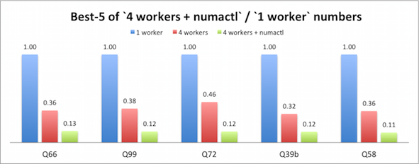
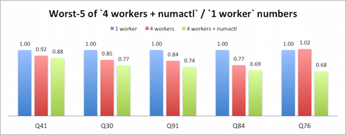

This is the TPCDS data generator for Apache Spark, which is split off from [spark-sql-perf](https://github.com/databricks/spark-sql-perf)
and includes pre-built [tpcds-kit](https://github.com/davies/tpcds-kit) for x86_64 on Mac/Linux platforms.
To check performance regression, TPCDS benchmark results for Spark master are daily stored
in [reports](https://docs.google.com/spreadsheets/d/1V8xoKR9ElU-rOXMH84gb5BbLEw0XAPTJY8c8aZeIqus/edit#gid=445143188) and
[charts](https://docs.google.com/spreadsheets/d/1V8xoKR9ElU-rOXMH84gb5BbLEw0XAPTJY8c8aZeIqus/edit#gid=2074944948) in Google Spreadsheet
are generated per the update.

## How to generate TPCDS data

First of all, you need to set up Spark:

    $ git clone https://github.com/apache/spark.git

    $ cd spark && ./build/mvn clean package -DskipTests

    $ export SPARK_HOME=`pwd`

Then, you can generate TPCDS test data in `/tmp`:

    $ ./bin/dsdgen /tmp

## How to run TPC-DS queries in Spark

You can run TPC-DS quries by using test data in `/tmp`:

    $ ./bin/spark-submit --class org.apache.spark.sql.execution.benchmark.TPCDSQueryBenchmark sql/core/target/spark-sql_<scala.version>-<spark.version>-tests.jar /tmp

## Options for the generator

    $ ./bin/dsdgen --help

    Usage: ./bin/dsdgen [options] [output dir]
    ...
    dsdgen options:
      --conf spark.sql.dsdgen.scaleFactor=NUM                    Scale factor (Default: 1).
      --conf spark.sql.dsdgen.format=STR                         Output format (Default: parquet).
      --conf spark.sql.dsdgen.overwrite=BOOL                     Wheter it overwrites existing data (Default: false).
      --conf spark.sql.dsdgen.partitionTables=BOOL               Wheter it partitions output data (Default: false).
      --conf spark.sql.dsdgen.useDoubleForDecimal=BOOL           Wheter it prefers double types (Default: false).
      --conf spark.sql.dsdgen.clusterByPartitionColumns=BOOL     Wheter it cluster output data by partition columns (Default: false).
      --conf spark.sql.dsdgen.filterOutNullPartitionValues=BOOL  Wheter it filters out NULL partitions (Default: false).
      --conf spark.sql.dsdgen.tableFilter=STR                    Filters a specific table.
      --conf spark.sql.dsdgen.numPartitions=NUM                  # of partitions (Default: 100).

## Run specific TPC-DS quries only

To run a part of TPC-DS queries, you type:

    $ ./bin/run-tpcds-benchmark --conf spark.sql.tpcds.queryFilter="q2,q5" [TPC-DS test data]

## Other helper scripts for benchmarks

To quickly generate the TPC-DS test data and run the queries, you just type:

    $ ./bin/report-tpcds-benchmark [output file]

This script finally formats performance results and appends them into ./reports/tpcds-avg-results.csv.
Notice that, if SPARK_HOME defined, the script uses the Spark.
Otherwise, it automatically clones the latest master in the repository and uses it.
To check performance differences with pull requests, you could set a pull request ID in the repository as an option
and run the quries against it.

    $ ./bin/report-tpcds-benchmark [output file] [pull request ID (e.g., 12942)]

## TPC-DS benchmark results on multi-socket environments

Multi-socket environments (multi-sockets and multi-cores) become common gradually in the world and I thnk many users might use Spark there.
However, we have a general question here; how does the number of Workers in a machine node impact Spark performance?
Then, I used an AWS EC2 x1.32xlarge (128 vCPUs, 4 sockets, and 1952 GiB) instance and
quickly run the TPC-DS quries on [the master branch](https://github.com/apache/spark/commit/520d92a191c3148498087d751aeeddd683055622)
in two conditions: 1 worker (SPARK_WORKER_INSTANCES=1) and 4 workers (SPARK_WORKER_INSTANCES=4).
I used openjdk v1.8.0_131 and Spark configurations were as follows;

    $ cat $SPARK_HOME/conf/spark-defaults.conf
    spark.driver.memory                   4g
    spark.executor.memory                 450g # 1800g in case of SPARK_WORKER_INSTANCES=1
    spark.executor.extraJavaOptions       -XX:+UseG1GC -XX:MaxGCPauseMillis=200
    spark.sql.shuffle.partitions          384
    spark.sql.autoBroadcastJoinThreshold  20971520 # 20MiB
    spark.sql.crossJoin.enabled           true
    spark.sql.parquet.compression.codec   snappy

Inspired by [the CWI paper](http://dl.acm.org/citation.cfm?doid=2771937.2771948), 
I also used NUMA-aware settings when launching 4 workers; the workers were assigned in each socket.
A hardware detail of x1.32xlarge instances is as follows;

    $ numactl --hardware
    available: 4 nodes (0-3)
    node 0 cpus: 0 1 2 3 4 5 6 7 8 9 10 11 12 13 14 15 64 65 66 67 68 69 70 71 72 73 74 75 76 77 78 79
    node 0 size: 491823 MB
    node 0 free: 484419 MB
    node 1 cpus: 16 17 18 19 20 21 22 23 24 25 26 27 28 29 30 31 80 81 82 83 84 85 86 87 88 89 90 91 92 93 94 95
    node 1 size: 491899 MB
    node 1 free: 483485 MB
    node 2 cpus: 32 33 34 35 36 37 38 39 40 41 42 43 44 45 46 47 96 97 98 99 100 101 102 103 104 105 106 107 108 109 110 111
    node 2 size: 491899 MB
    node 2 free: 472123 MB
    node 3 cpus: 48 49 50 51 52 53 54 55 56 57 58 59 60 61 62 63 112 113 114 115 116 117 118 119 120 121 122 123 124 125 126 127
    node 3 size: 491898 MB
    node 3 free: 482366 MB
    node distances:
    node   0   1   2   3
      0:  10  20  20  20
      1:  20  10  20  20
      2:  20  20  10  20
      3:  20  20  20  10

Based on the NUMA configuration above, I launched 4 workers with a `numactl` command;

    $ export SPARK_WORKER_CORES=32
    $ export SPARK_WORKER_MEMORY=450g
    $ numactl -m 0 -C 0-15,64-79 ./sbin/start-slave.sh <master URL> &
    $ numactl -m 1 -C 16-31,80-95 ./sbin/start-slave.sh <master URL> &
    $ numactl -m 2 -C 32-47,96-111 ./sbin/start-slave.sh <master URL> &
    $ numactl -m 3 -C 48-63,112-127 ./sbin/start-slave.sh <master URL> &

I got TPC-DS query performance numbers on the 3 conditions above and computed relative performance indicators,
(`4 workers + numactl` / `1 worker`) numbers. I show you the best/worst 5 queries below;

The results a bit suprised me and the Q58 performance of `4 workers + numactl` was about 9x faster than `1 worker`.
As you can see the worst-5 numbers, we had no negative impact by the NUMA-aware settings.
Based on the investigation, I strongly recommend you to use `numactl` for launching multiple workers on a node with multi-sockets.

I wrote easy-to-use scripts (`start-slave-with-numactl.sh` and `stop-slave-with-numactl.sh`)
to control workers by taking into account NUMA configurations in your Spark cluster.
The script starts a single worker for each socket if `numactl` installed.
To launch workers with this script in your cluster, you just say:

    $ ./bin/copy-dir sbin                 // Copy the two scripts in your Spark cluster
    $ ./bin/start-slaves.sh

To stop workers launched by the script above, you say:

    $ ./bin/stop-slaves.sh

## Bug reports

If you hit some bugs and requests, please leave some comments on [Issues](https://github.com/maropu/spark-sql-server/issues)
or Twitter([@maropu](http://twitter.com/#!/maropu)).

